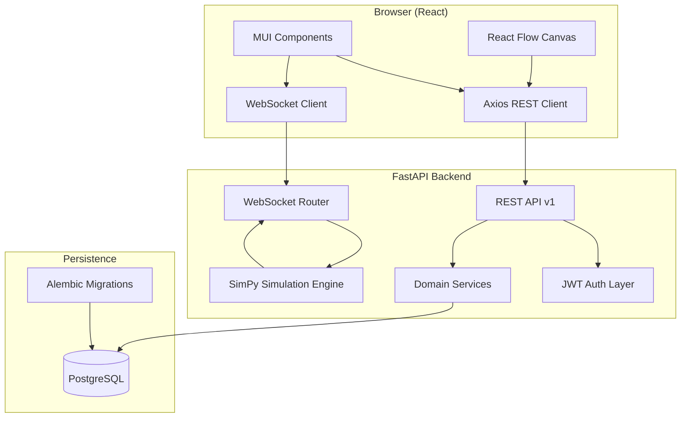
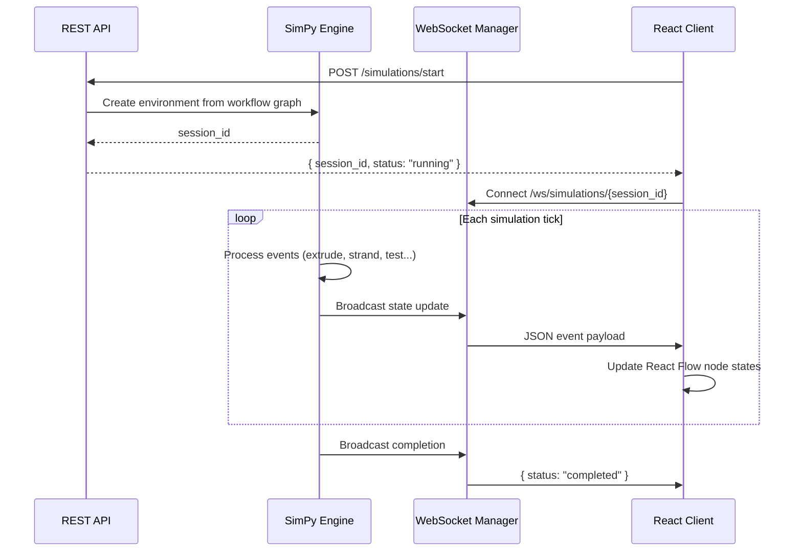
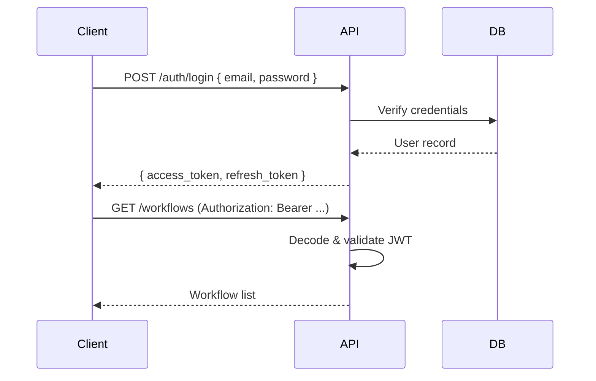
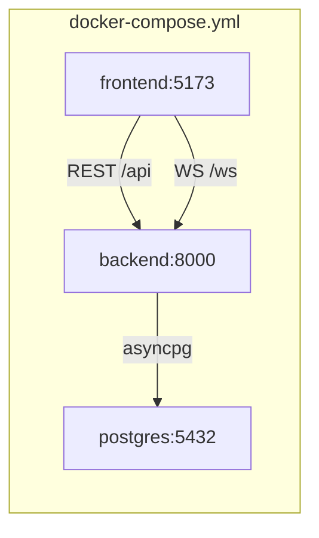

# Architecture — Cable Automation Workflow Simulator

This document describes the system architecture, component boundaries, data flows, and planned implementation areas for the Cable Automation Workflow Simulator.

## 1. System Overview

The platform enables engineers to **design** cable manufacturing workflows visually, **simulate** them using discrete-event modeling, and **monitor** execution in real time.



## 2. Architectural Principles

| Principle | Application |
| --------- | ----------- |
| **Separation of concerns** | API routes delegate to services; services own business logic; models/schemas are isolated |
| **Async-first backend** | SQLAlchemy async sessions, async FastAPI endpoints, non-blocking WebSocket I/O |
| **Real-time by design** | Simulation events stream over WebSockets; REST for CRUD and control commands |
| **Type safety** | Pydantic schemas on backend; TypeScript interfaces on frontend |
| **Container-native** | Docker Compose for local dev; multi-stage builds for production |

## 3. Component Responsibilities

### 3.1 Frontend (`frontend/`)

| Module | Path | Responsibility |
| ------ | ---- | -------------- |
| **Pages** | `src/pages/` | Route-level views (dashboard, editor, simulation monitor) |
| **Components** | `src/components/` | Reusable MUI-based UI building blocks |
| **Flows** | `src/flows/` | React Flow node types, edge types, canvas layout, serialization |
| **Auth** | `src/auth/` | Login/register forms, JWT storage, route guards |
| **API Client** | `src/api/client.ts` | Axios instance, interceptors for token refresh |
| **WebSocket Hook** | `src/hooks/useWebSocket.ts` | Connection lifecycle, message parsing |
| **Types** | `src/types/` | Shared domain TypeScript interfaces |

#### Planned User Flows

1. **Authenticate** → obtain JWT, store in memory/secure storage
2. **Design workflow** → drag cable-process nodes (extrusion, stranding, jacketing, testing) onto React Flow canvas
3. **Save workflow** → serialize graph JSON → `POST /api/v1/workflows`
4. **Run simulation** → `POST /api/v1/simulations/start` → connect WebSocket → render live state on canvas
5. **Monitor** → receive tick events, node state changes, throughput metrics

### 3.2 Backend (`backend/app/`)

| Module | Path | Responsibility |
| ------ | ---- | -------------- |
| **Main** | `main.py` | App factory, CORS, lifespan, router mounting |
| **Config** | `config.py` | Environment-driven settings via Pydantic |
| **Database** | `database.py` | Async engine, session factory, `Base` declarative class |
| **API v1** | `api/v1/endpoints/` | HTTP route handlers (thin controllers) |
| **Dependencies** | `api/deps.py` | `get_db`, `get_current_user`, pagination |
| **Core** | `core/security.py` | Password hashing, JWT create/verify/decode |
| **Models** | `models/` | SQLAlchemy ORM entities |
| **Schemas** | `schemas/` | Pydantic request/response DTOs |
| **Services** | `services/` | Business logic orchestration |
| **Simulation** | `services/simulation/` | SimPy environment, process definitions, event emission |
| **WebSockets** | `websockets/` | Connection manager, simulation event broadcast |

#### Layered Request Flow

```
HTTP Request
    → FastAPI Router (endpoints/)
    → Dependency Injection (deps.py: auth, db)
    → Service Layer (services/)
    → ORM Models / SimPy Engine
    → Pydantic Schema Response
```

### 3.3 Database (PostgreSQL)

Implemented entities — see [Database Schema](DATABASE.md) for full ERD and migration details.

| Table | Purpose |
| ----- | ------- |
| `users` | Authentication credentials and profile |
| `cable_types` | Cable product specifications |
| `machines` | Factory equipment inventory |
| `production_orders` | Manufacturing work orders |
| `workflow_steps` | Ordered process steps per order |
| `machine_logs` | Operational telemetry from machines |
| `simulation_logs` | SimPy simulation event stream |
| `reports` | Generated analysis documents |
| `alarms` | Machine/order alerts with acknowledgement |

All timestamped tables inherit `TimestampMixin` (`created_at`, `updated_at`) from `models/base.py`.

### 3.4 Simulation Engine (SimPy)

The SimPy engine runs as an in-process discrete-event simulator:



**Key design decisions (planned):**

- Each workflow node maps to a SimPy `Process` or `Resource`
- Edges define precedence / material flow constraints
- Tick interval controlled by `SIMULATION_DEFAULT_TICK_MS`
- Concurrent runs capped by `SIMULATION_MAX_CONCURRENT`
- Engine runs in a background task (`asyncio.create_task`) decoupled from the HTTP request lifecycle

## 4. Authentication Flow (JWT)



| Token | Lifetime | Storage (frontend) |
| ----- | -------- | ------------------ |
| Access | 30 min (configurable) | Memory or sessionStorage |
| Refresh | 7 days (configurable) | httpOnly cookie (recommended) or secure storage |

## 5. Real-Time Communication

### WebSocket Protocol (Planned)

**Endpoint:** `ws://host/ws/simulations/{session_id}`

**Server → Client message types:**

```json
{ "type": "tick", "timestamp": 1.5, "sim_time": 120.0 }
{ "type": "node_state", "node_id": "extruder-1", "state": "running", "progress": 0.42 }
{ "type": "metric", "name": "throughput_m_per_min", "value": 15.3 }
{ "type": "completed", "summary": { "duration_s": 300, "units_produced": 1500 } }
{ "type": "error", "message": "Resource contention at node strander-2" }
```

**Client → Server:** control commands (pause, resume, speed multiplier) — to be defined.

### Connection Manager

`websockets/manager.py` maintains a mapping of `session_id → [WebSocket connections]` to support multiple viewers per simulation.

## 6. Docker Architecture



| Service | Image / Build | Ports | Notes |
| ------- | ------------- | ----- | ----- |
| `postgres` | `postgres:16-alpine` | 5432 | Persistent volume `postgres_data` |
| `backend` | `backend/Dockerfile` | 8000 | Hot reload in dev via volume mount |
| `frontend` | `frontend/Dockerfile` (dev target) | 5173 | Vite dev server; production uses nginx stage |

## 7. Configuration Management

All configuration flows through environment variables:

- **Root `.env`** — shared by Docker Compose
- **`backend/app/config.py`** — Pydantic `Settings` class with typed defaults
- **`frontend/.env`** — Vite-prefixed (`VITE_*`) variables baked at build time

Sensitive values (`SECRET_KEY`, `POSTGRES_PASSWORD`) must never be committed.

## 8. Planned API Contract

### Workflows

```typescript
interface WorkflowCreate {
  name: string;
  description?: string;
  nodes: WorkflowNode[];
  edges: WorkflowEdge[];
}
```

### Simulations

```typescript
interface SimulationStartRequest {
  workflow_id: string;
  config?: {
    tick_ms?: number;
    speed_multiplier?: number;
  };
}

interface SimulationStartResponse {
  session_id: string;
  status: "running";
}
```

## 9. Error Handling Strategy (Planned)

| Layer | Strategy |
| ----- | -------- |
| API | HTTP status codes + structured `{ detail: ... }` responses |
| Validation | Pydantic 422 with field-level errors |
| Auth | 401 for invalid/expired tokens; 403 for insufficient permissions |
| Simulation | Graceful shutdown; error events over WebSocket |
| Frontend | Axios interceptor for 401 → redirect to login |

## 10. Testing Strategy (Planned)

| Area | Tool | Scope |
| ---- | ---- | ----- |
| Backend unit | pytest | Services, security, schemas |
| Backend integration | pytest + httpx | API endpoints with test DB |
| Frontend unit | Vitest (TBD) | Hooks, utilities |
| E2E | Playwright (TBD) | Full workflow design → simulate |

## 11. Implementation Roadmap

The scaffold is complete. Recommended implementation order:

1. **Database models & migrations** — `User`, `Workflow`, `SimulationSession`
2. **Authentication** — register, login, JWT middleware
3. **Workflow CRUD** — REST endpoints + frontend editor shell
4. **React Flow canvas** — custom cable-process node types
5. **SimPy engine** — graph → process mapping, event generation
6. **WebSocket integration** — wire engine events to clients
7. **Simulation UI** — live monitoring dashboard
8. **Production hardening** — logging, rate limiting, health checks, CI/CD

## 12. Security Considerations

- Passwords hashed with bcrypt (passlib)
- JWT signed with HS256 (upgrade to RS256 for multi-service deployments)
- CORS restricted to configured origins
- SQL injection prevented via SQLAlchemy parameterized queries
- WebSocket connections should validate JWT on connect (planned)
- Rate limiting on auth endpoints (planned)

---

*Last updated: v1.0.0 — full stack implemented (REST API, WebSocket simulation, React UI)*
