# Database Schema

PostgreSQL schema for the Cable Automation Workflow Simulator.

## Entity Relationship Diagram

```mermaid
erDiagram
    users ||--o{ production_orders : creates
    users ||--o{ reports : generates
    users ||--o{ alarms : acknowledges
    cable_types ||--o{ production_orders : specifies
    production_orders ||--|{ workflow_steps : contains
    production_orders ||--o{ machine_logs : references
    production_orders ||--o{ simulation_logs : tracks
    production_orders ||--o{ reports : produces
    production_orders ||--o{ alarms : triggers
    machines ||--o{ workflow_steps : executes
    machines ||--o{ machine_logs : emits
    machines ||--o{ alarms : raises
    workflow_steps ||--o{ simulation_logs : logs

    users {
        uuid id PK
        string email UK
        string username UK
        string hashed_password
        string full_name
        enum role
        bool is_active
        timestamptz created_at
        timestamptz updated_at
    }

    cable_types {
        uuid id PK
        string code UK
        string name
        text description
        int conductor_count
        numeric diameter_mm
        string insulation_type
        numeric voltage_rating_kv
        int max_length_m
    }

    machines {
        uuid id PK
        string code UK
        string name
        enum machine_type
        enum status
        string location
        numeric capacity_m_per_min
        bool is_active
    }

    production_orders {
        uuid id PK
        string order_number UK
        uuid cable_type_id FK
        uuid created_by_user_id FK
        int quantity_m
        enum status
        enum priority
        date requested_delivery_date
        timestamptz started_at
        timestamptz completed_at
    }

    workflow_steps {
        uuid id PK
        uuid production_order_id FK
        uuid machine_id FK
        int sequence_order
        enum step_type
        enum status
        numeric planned_duration_min
        numeric actual_duration_min
        jsonb parameters
    }

    machine_logs {
        uuid id PK
        uuid machine_id FK
        uuid production_order_id FK
        enum level
        text message
        jsonb metrics
        timestamptz logged_at
    }

    simulation_logs {
        uuid id PK
        uuid production_order_id FK
        uuid workflow_step_id FK
        enum event_type
        numeric sim_time
        text message
        jsonb payload
        timestamptz recorded_at
    }

    reports {
        uuid id PK
        uuid production_order_id FK
        uuid generated_by_user_id FK
        enum report_type
        string title
        text summary
        jsonb content
        timestamptz generated_at
    }

    alarms {
        uuid id PK
        uuid machine_id FK
        uuid production_order_id FK
        enum severity
        string code
        text message
        bool is_acknowledged
        uuid acknowledged_by_user_id FK
        timestamptz triggered_at
    }
```



## Tables

| Table | Description | Key Relationships |
| ----- | ----------- | ----------------- |
| `users` | System accounts with role-based access | → orders, reports, alarms |
| `cable_types` | Cable product specifications | → production orders |
| `machines` | Factory equipment inventory | → workflow steps, logs, alarms |
| `production_orders` | Manufacturing work orders | Central hub for workflow, logs, reports |
| `workflow_steps` | Ordered process steps per order | Links orders to machines |
| `machine_logs` | Operational telemetry from machines | Optional order context |
| `simulation_logs` | SimPy simulation event stream | Optional workflow step context |
| `reports` | Generated analysis documents | Linked to orders and users |
| `alarms` | Machine/order alerts | Acknowledgement workflow |

## Enums

| PostgreSQL Type | Values |
| --------------- | ------ |
| `user_role` | admin, engineer, operator, viewer |
| `order_status` | draft, scheduled, in_progress, completed, cancelled, on_hold |
| `order_priority` | low, normal, high, urgent |
| `machine_type` | extruder, strander, armoring, jacketing, capstan, tester, spooler |
| `machine_status` | idle, running, maintenance, fault, offline |
| `workflow_step_type` | extrusion, stranding, armoring, jacketing, testing, spooling |
| `workflow_step_status` | pending, in_progress, completed, skipped, failed |
| `log_level` | debug, info, warning, error, critical |
| `simulation_event_type` | started, tick, node_state, metric, completed, error, stopped |
| `report_type` | production_summary, quality, simulation, efficiency, daily |
| `alarm_severity` | info, warning, critical, emergency |

## Migrations

```bash
cd backend
alembic upgrade head      # Apply migrations
alembic downgrade -1      # Roll back one revision
alembic history           # View revision history
```

Initial migration: `001_initial_schema`

## Seed Data

```bash
cd backend
python -m app.db.seed
```

| Entity | Count |
| ------ | ----- |
| Users | 4 |
| Cable Types | 6 |
| Machines | 8 |
| Production Orders | 5 |
| Workflow Steps | 15 |
| Machine Logs | 6 |
| Simulation Logs | 6 |
| Reports | 4 |
| Alarms | 5 |

Reference JSON: [`backend/data/sample_datasets.json`](../backend/data/sample_datasets.json)

Default password for all seeded users: `CableSim123!`

## Cascade Rules

| Parent | Child | On Delete |
| ------ | ----- | --------- |
| `production_orders` | `workflow_steps` | CASCADE |
| `production_orders` | `simulation_logs` | CASCADE |
| `production_orders` | `reports` | CASCADE |
| `machines` | `machine_logs` | CASCADE |
| `machines` | `alarms` | CASCADE |
| `production_orders` | `machine_logs` | SET NULL |
| `workflow_steps` | `simulation_logs` | SET NULL |
